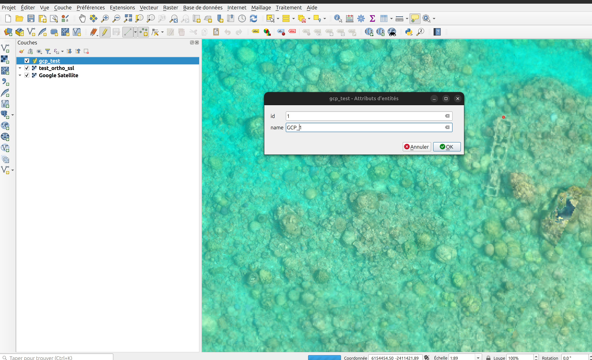
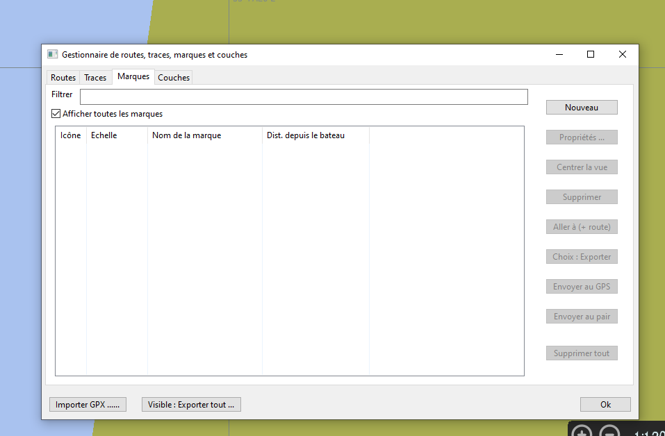
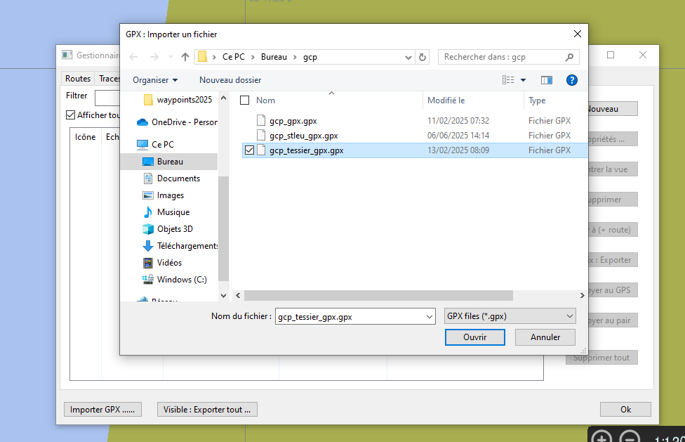
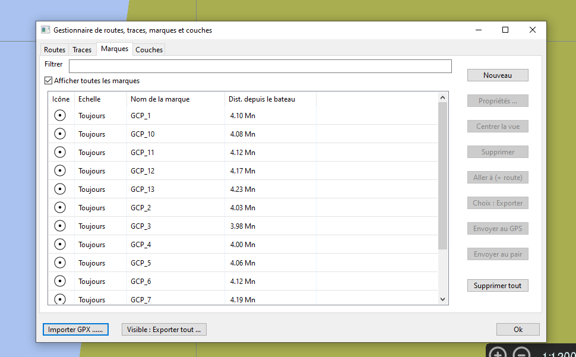
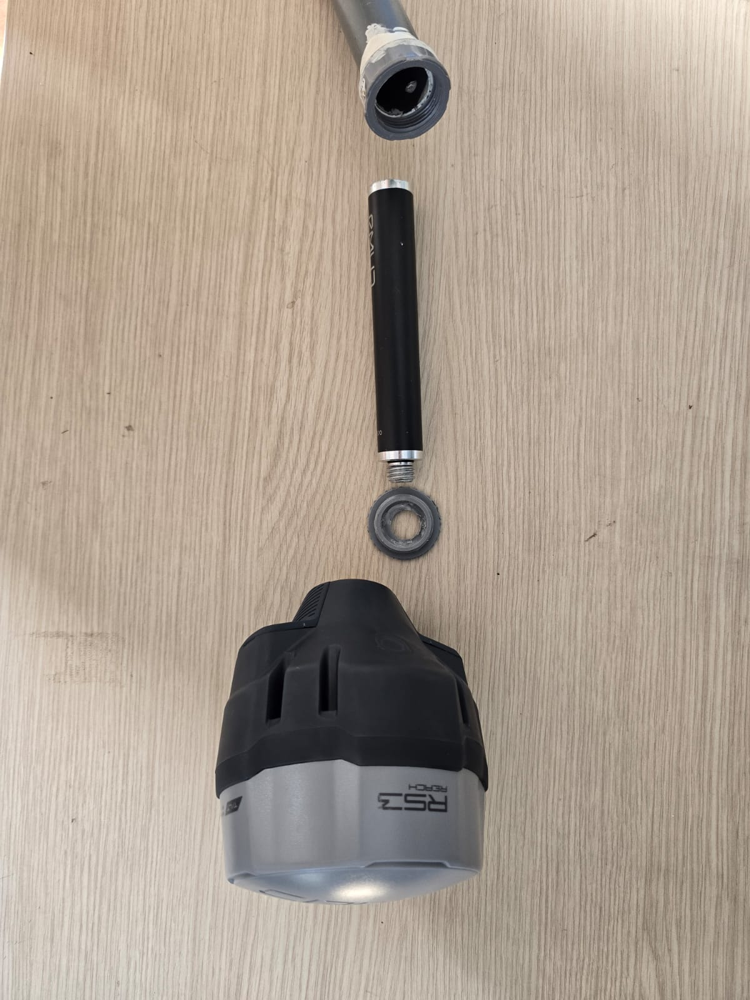

# Mode d'emploi pour faire l'acquisition de GCP façon ifremer la réunion.

Un GCP (Ground Control Point) est un point dont la position GPS est connue avec précision. Ces points servent à recadrer les orthophotos issues de relevés réalisés avec des planches ou des drones.

Dans des conditions idéales, on place un damier sous l’eau au moment de l’acquisition, et on en relève précisément la position. Dans notre cas, les GCPs sont définis à partir de repères fixes visibles, comme un poteau électrique, un corail caractéristique ou toute autre forme reconnaissable facilement sur les images.

Pour réaliser cette mission, il y a quelques étapes à préparer.

## Préparation des points d’acquisition

Commencez par repérer des points clairement visibles et stables dans le temps. Pour cela, utilisez une orthophoto déjà produite.

Suivez le tutoriel présent dans le README du projet [tms-server](https://github.com/SeatizenDOI/tms-server) pour afficher ces orthophotos dans QGIS.

Créez une nouvelle couche de points dans QGIS. Voici un exemple de création de couche :

Ajoutez ensuite des points sur les éléments facilement reconnaissables : corail atypique, épave, structure anthropique, etc.

Important : N’oubliez pas de nommer chaque point avec un label clair. Cela facilitera l’identification sur le terrain.

Une fois tous les points placés, exportez la couche au format GPX. Veillez à cocher l’option `GPS_USE_EXTENSION` à `YES`.

Afin de faciliter le repérage sur le terrain, réalisez des captures d’écran à plusieurs niveaux de zoom (de large à rapproché) pour chaque point.

Ces images seront regroupées dans un document, à imprimer et à glisser dans un porte-vues pour le nageur. VOici un exemple de document : [Exemple de zoom sur les images](https://docs.google.com/document/d/1ptK9-qr9mCME2GhcnH1CtaoIks5ZM6Ax7CxGaGRJh50/edit?usp=sharing)

## Setup de l'ordinateur

Il est nécessaire d'avoir un ordinateur avec un GPS et les points de mesures à l'intérieur pour facilement se rendre sur la zone. Cela permet de la délimiter facilement.

- Un ordinateur de terrain
- un reach M2 avec une antenne et un cable USB pour le connecter à l'ordinateur
- Le logiciel [OpenCPN](https://opencpn.org/)

Branchez le GPS à l’ordinateur, puis configurez le port série et le débit comme montré ci-dessous :

Importez votre fichier GPX pour afficher les points d’intérêt dans le logiciel. Vérifiez que chaque point est bien nommé.

## Setup de la base.

La base GPS est montée sur un tube en PVC. Il est important de mesurer la hauteur du tube pour la renseigner dans l'application (important pour la précision altimétrique).

Vissez la base sur son support comme illustré ci-dessous :

Pour réaliser un survey, suivez le [tutoriel](https://docs.emlid.com/emlid-flow/survey-with-ef/points/collector/)